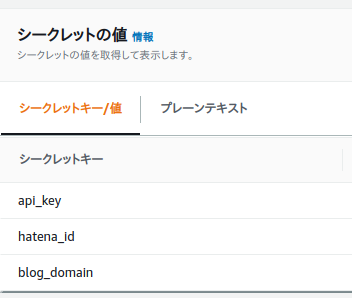

# post-qiita-summary-to-hatenablog

## 設定項目

事前に設定しておくべき項目を以下に示す。

## AWS Lambda

AWS Lambda に以下の値を設定しておくこと。

### 環境変数

- HATENABLOG_SECRET_NAME
  - 意味：はてなブログの API キーなどを格納したシークレットの名前
  - 例：`secrets/hatenablog`
- QIITA_SECRET_NAME
  - 意味：Qiita のユーザ名などを格納したシークレットの名前
  - 例：`secrets/qiita`
- LOG_LEVEL
  - 意味：ログレベル `CRITICAL, ERROR, WARNING, INFO, DEBUG` から選択
  - 例：`DEBUG`

### Secrets

### Hatenablog



- api_key
  - 意味：Basic 認証用の API key。[ブログの詳細設定](http://blog.hatena.ne.jp/my/config/detail)画面から取得
  - 例：`21afjlij4224`
- hatena_id
  - 意味：あなたのはてな ID
  - 例：`hoge`
- blog_domain
  - 意味：ブログの ID
  - 例：`hoge.hatenablog.com`

### Qiita


- user_id
  - 意味：あなたのユーザ名
  - 例：`kannkyo`

## 使い方

### ソースコードのアップロード

まず、aws-cli を事前に設定しておくこと。

```bash
aws configure
```

次に、アップロードスクリプトを実行すること。

```bash
./upload.sh
```
